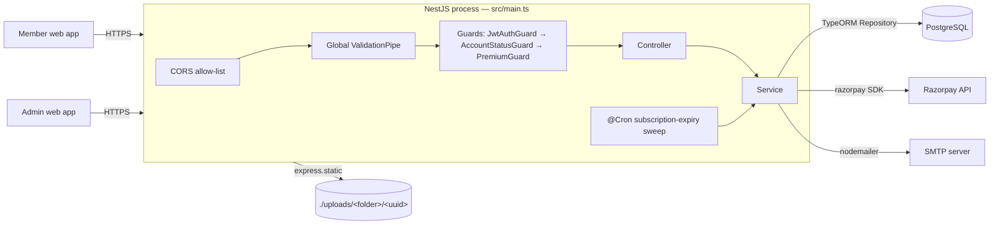
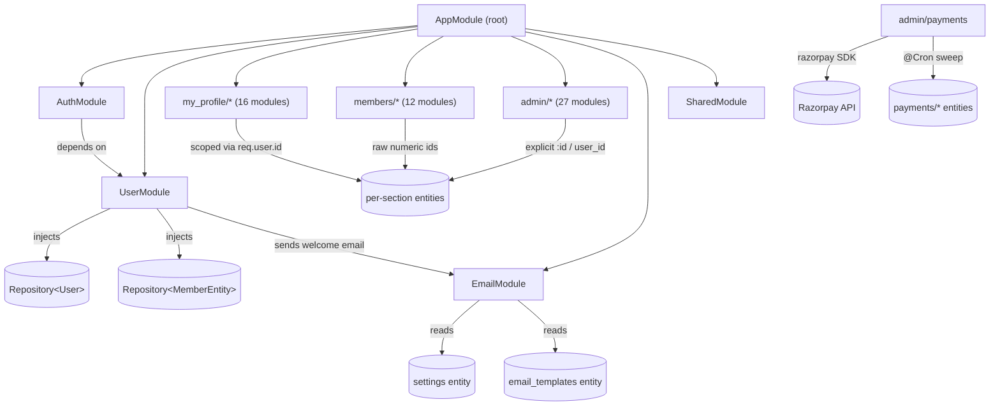
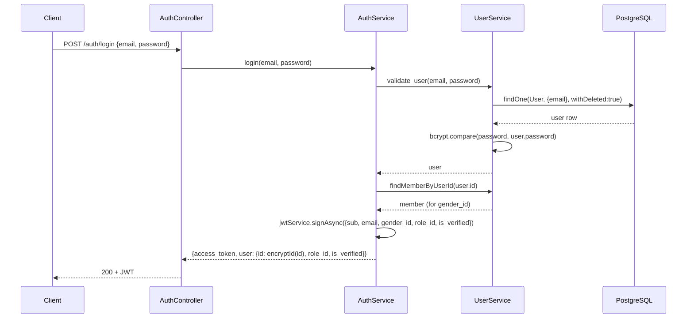
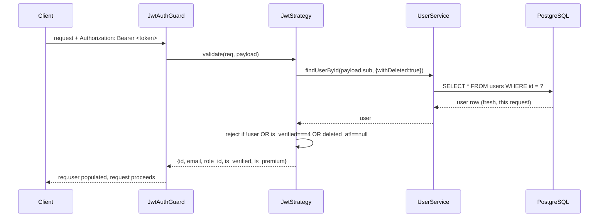
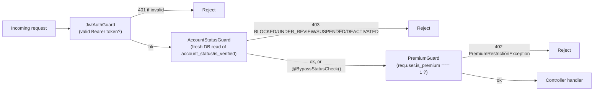

# Architecture

## Stack

| Layer | Technology |
|---|---|
| Language | TypeScript |
| Framework | NestJS 11 (Express platform) |
| ORM | TypeORM 0.3 |
| Database | PostgreSQL |
| Auth | JWT (`@nestjs/jwt`, `passport-jwt`) |
| Validation | `class-validator` / `class-transformer` |
| File uploads | Multer (local disk storage) |
| Payments | Razorpay |
| Scheduling | `@nestjs/schedule` (cron) |
| API docs | Swagger / OpenAPI at `GET /api` |
| Email | `nodemailer`, DB-driven templates/SMTP config |

## Process shape

Single NestJS process (`src/main.ts`) → single Express HTTP server → single PostgreSQL database. No message queue, no cache layer, no separate worker process — the scheduled subscription-expiry job (`@nestjs/schedule`) runs in-process. Static file serving for `/uploads` is Express static middleware inside the same process.



## Folder organization / module layering

`src/app.module.ts` is the composition root — it imports every feature module (~60 of them) into one flat `imports` array. There is no sub-application/microservice split; "layering" is by folder convention, not by Nest module boundaries:

- **`src/auth/`** — login, JWT strategy/guards, account-status/premium guards.
- **`src/user/`** — registration + core user lookups (the `User` entity/service that other modules depend on for identity).
- **`src/shared/`** — small cross-cutting endpoints not owned by a specific feature area.
- **`src/config/`** — `appConfig` (builds public upload URLs) and the Multer config factory.
- **`src/common/`** — shared interfaces + the AES id-encryption utility (`src/common/utils/encryption.util.ts`).
- **`src/dto/`** — request-body validation classes, referenced by controllers across all feature folders.
- **`src/entities/`** — all TypeORM entities (see [docs/DATABASE.md](docs/DATABASE.md)).
- **`src/email/`** — nodemailer wrapper + DB-templated email sending (no HTTP routes of its own).
- **`src/helpers/`** — supporting helpers (e.g. `transporter.helper.ts`, builds the nodemailer transport from the `settings` table).
- **`src/my_profile/*`** — endpoints for the authenticated member managing their **own** profile sections.
- **`src/members/*`** — endpoints for browsing and interacting with **other** members.
- **`src/admin/*`** — admin-only endpoints: per-section `*_management` modules mirroring each `my_profile` section, plus `master/*` reference-data CRUD, plus users-list, member management, payments, user subscriptions, chat monitor, analytics, report/block/shortlist/visitor management, terms & conditions, approve-success-story, and the admin's own profile settings.

Every feature module follows the same three-plus-one-file pattern: `*.module.ts`, `*.controller.ts`, `*.service.ts`, `*.spec.ts`. Full per-module inventory: [docs/MODULES.md](docs/MODULES.md).

## Module relationships / dependency flow



Every `admin/*_management` module is an independent Nest module that talks directly to the same entities as its `my_profile/*` counterpart — there is no shared service layer between a profile-section module and its admin mirror; each re-implements its own upsert/delete logic against the same table.

## Authentication flow



On every subsequent guarded request, Passport re-invokes `JwtStrategy.validate()` — it is **not** a stateless token-only check:



This means `req.user.is_premium` and `req.user.is_verified` are always fresh as of the *start* of the current request (re-fetched by `JwtStrategy`), even though `PremiumGuard` itself does not re-query the database — it just reads the value `JwtStrategy` already fetched this request.

## Authorization flow (guards)

Three composable guards, applied via `@UseGuards(...)` at the controller (occasionally method) level, run in this order when combined:



| Guard | File | Behavior |
|---|---|---|
| `JwtAuthGuard` | `src/auth/guards/jwt-auth.guard.ts` | Thin `AuthGuard('jwt')` wrapper — triggers the `JwtStrategy` flow above. |
| `AccountStatusGuard` | `src/auth/guards/account-status.guard.ts` | Re-reads `id, account_status, is_verified, account_status_message` fresh from the database on every request and throws `403 ForbiddenException` with an `errorCode` (`BLOCKED`, `UNDER_REVIEW`, `SUSPENDED`, `DEACTIVATED`) matching whichever condition matches first (checked in that order). Skipped entirely if the route/handler is annotated `@BypassStatusCheck()`. |
| `PremiumGuard` | `src/auth/guards/premium.guard.ts` | Throws `PremiumRestrictionException` (HTTP 402, `requires_premium: true`) unless `Number(request.user.is_premium) === 1`. Reads the value already populated onto `req.user` by `JwtStrategy` earlier in the same request. |

Guard composition is a **per-module convention**, not enforced by a shared base class — match the sibling routes in the module you're editing. Full per-module guard list: [docs/API.md](docs/API.md).

## Request lifecycle (end-to-end)

```mermaid
sequenceDiagram
    participant C as Client
    participant Ex as Express (main.ts)
    participant VP as Global ValidationPipe
    participant G as Guards
    participant Ctrl as Controller
    participant Svc as Service
    participant Repo as TypeORM Repository
    participant DB as PostgreSQL

    C->>Ex: HTTP request
    Ex->>Ex: CORS check (hard-coded origin allow-list)
    Ex->>VP: route matched
    VP->>VP: validate/transform body against route DTO (whitelist: true)
    VP->>G: JwtAuthGuard → AccountStatusGuard → PremiumGuard (as declared)
    G->>Ctrl: request authorized
    Ctrl->>Ctrl: decrypt "my profile" id if AES-encrypted (encryption.util.ts)
    Ctrl->>Svc: delegate to service method
    Svc->>Repo: Repository&lt;Entity&gt; query/save
    Repo->>DB: SQL
    DB-->>Repo: rows
    Repo-->>Svc: entity/entities
    Svc-->>Ctrl: result
    Ctrl-->>C: JSON response
```

## Exception handling

No custom global `ExceptionFilter` is registered anywhere in the codebase (`grep` for `@Catch(`/`ExceptionFilter` across `src/` returns nothing) — Nest's default exception handling is used throughout. Controllers/services throw built-in Nest HTTP exceptions (`BadRequestException`, `UnauthorizedException`, `ForbiddenException`, `NotFoundException`) directly, plus one custom exception class: `PremiumRestrictionException` (`src/auth/guards/premium-restriction.exception.ts`, extends `HttpException`, always 402 with `requires_premium: true`). Error response shape is therefore whatever Nest's default `HttpException` JSON body produces, with `AccountStatusGuard` additionally attaching an `errorCode` field to its 403 payloads.

## Logging

No structured/global logging framework is configured (no Winston, Pino, or a custom global `Logger` provider). A small number of controllers instantiate Nest's built-in `Logger` locally (e.g. `src/my_profile/profile_settings/profile_settings.controller.ts`, `src/admin/user_basic_info/user_basic_info.controller.ts`) for ad-hoc debug logging; most modules log nothing beyond Nest's own startup/framework logs. Several services have commented-out `console.log` debug statements left in place (e.g. `AuthService.login`, `AccountStatusGuard`, `PaymentsService.autoExpireSubscriptions`).

## Validation

Global `ValidationPipe` (registered in `src/main.ts`): `whitelist: true` (strips fields not declared on the DTO), `forbidNonWhitelisted: false` (silently drops them rather than rejecting the request), `transform: true` (coerces primitives — e.g. query/multipart string values — to the types declared on the DTO). Every request body has a corresponding DTO class under `src/dto/` using `class-validator` decorators (`@IsOptional`, `@IsString`, `@IsNumber` + `@Type(() => Number)` for numeric fields arriving as strings via multipart/form-data).

## Middleware

Only one piece of Express middleware is registered, in `src/main.ts`: `express.static` serving `./uploads` at the `/uploads` path. No custom `NestMiddleware` classes exist anywhere in `src/` (`grep` for `NestMiddleware`/`configure(consumer` returns nothing) — no request-logging middleware, no custom body-size limiter, etc.

## Interceptors

No custom `NestInterceptor` classes exist in the codebase. The only interceptor usage is Nest/Express's built-in `FileInterceptor`/`FilesInterceptor` (`@nestjs/platform-express`), applied per-route on upload endpoints (e.g. `profile_gallery`, `gallery_management`, `my-profile-settings`, `user_basic_info`, `approve_success_story`) together with `createMulterConfig(folder)` from `src/config/multer.config.ts`.

## Cross-cutting concerns

- **Scheduling** — `PaymentsService.autoExpireSubscriptions` (`@Cron('0 * * * * *')`, i.e. every minute — its own docstring says "at midnight", which does not match the actual cron expression) runs in-process, sweeping `user_subscriptions` where `status = 'active'` and `end_date` has passed, flipping them to `'expired'` and the owning `User.is_premium` to `0` inside a transaction. Not guarded against duplicate execution across multiple app instances — see [DEPLOYMENT.md](DEPLOYMENT.md).
- **Payments** — Razorpay order creation/verification lives in `src/admin/payments/payments.service.ts`. `verifyPayment` computes an HMAC-SHA256 signature over `${order_id}|${payment_id}` using `RAZORPAY_KEY_SECRET` and compares it to the client-supplied signature before activating a subscription; the activation logic supports "stacking" a renewal onto an existing still-active subscription (new period starts at the old period's `end_date`) rather than always starting from "now". See [docs/BUSINESS_FLOW.md](docs/BUSINESS_FLOW.md).
- **Email** — `src/email/email.service.ts` loads an `EmailTemplateEntity` by `template_key` + the single active `SettingsEntity` row, does `{{variable}}` substitution against merged template/settings/call-site data, and sends via a `nodemailer` transport built from the settings row's SMTP fields (host/port/username/password/encryption/from). SMTP configuration is **database-driven, not environment-variable-driven**.
- **Swagger** — assembled in `src/main.ts` (`DocumentBuilder`, Bearer auth) and served at `/api`; decorator coverage (`@ApiTags`/`@ApiOperation`) is inconsistent across modules.
- **ID encryption** — `src/common/utils/encryption.util.ts` (`encryptId`/`decryptId`, AES via `crypto-js`, keyed by `ID_SECRET_KEY`) is applied per-route by convention (`my_profile/*` GET urls) — not a global interceptor/pipe, so it's easy to miss on a newly added route. See [docs/API.md](docs/API.md).

## Known architectural gaps

- No migration tooling despite `synchronize: false` — entity changes require manual DDL.
- `main.ts` reads `process.env.PORT`, not the documented `APP_PORT`.
- CORS origins are a hard-coded array in `src/main.ts`, not environment-driven.
- Local-disk file storage (`./uploads/`) won't survive multi-instance/ephemeral deployments.
- The subscription-expiry cron has no leader-election/locking — would double-run under horizontal scaling.
- `FRONTEND_URL` is referenced by the registration email but not defined in `.env`.
- **Six `admin/master/*` controllers have no guard at all** — `countries`, `states`, `cities`, `gender`, `mother_tongue`, and `religion` declare no `@UseGuards` anywhere in their controllers (verified by inspecting each file directly), meaning their `update-create`/`delete-*` write endpoints are reachable **without authentication**. This is inconsistent with the sibling master modules (`education`, `profession_master`, `designation_master`, `specialisation`, `subscription_plans`, `privacy_policy`) which do apply `JwtAuthGuard`. See [docs/API.md](docs/API.md) and [docs/MODULES.md](docs/MODULES.md).

See [DEPLOYMENT.md](DEPLOYMENT.md) for the deployment-time implications of these gaps.
