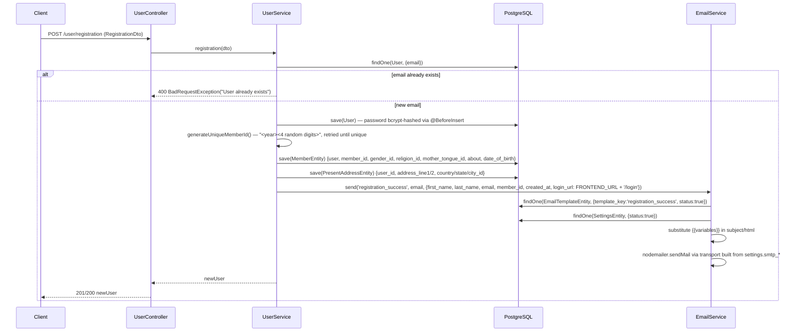
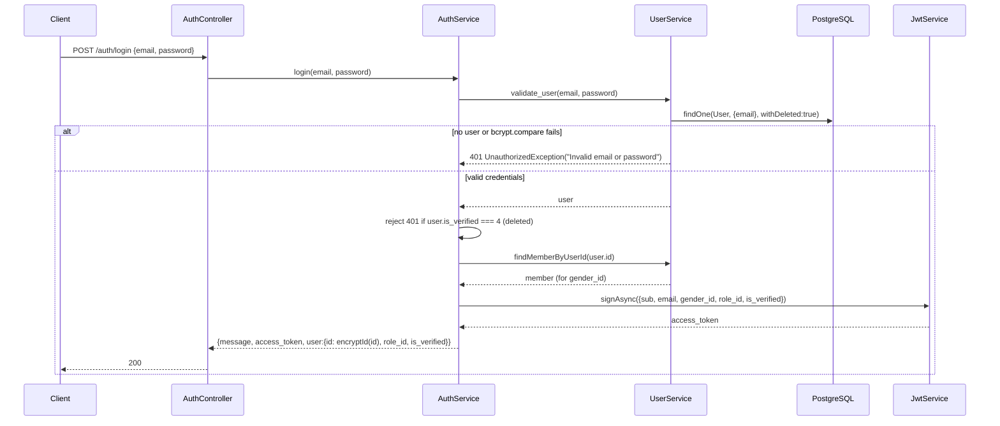
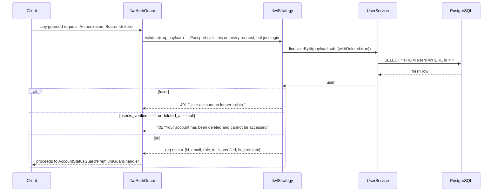
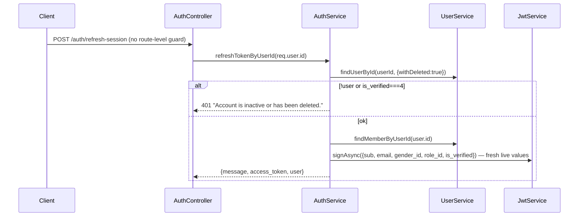
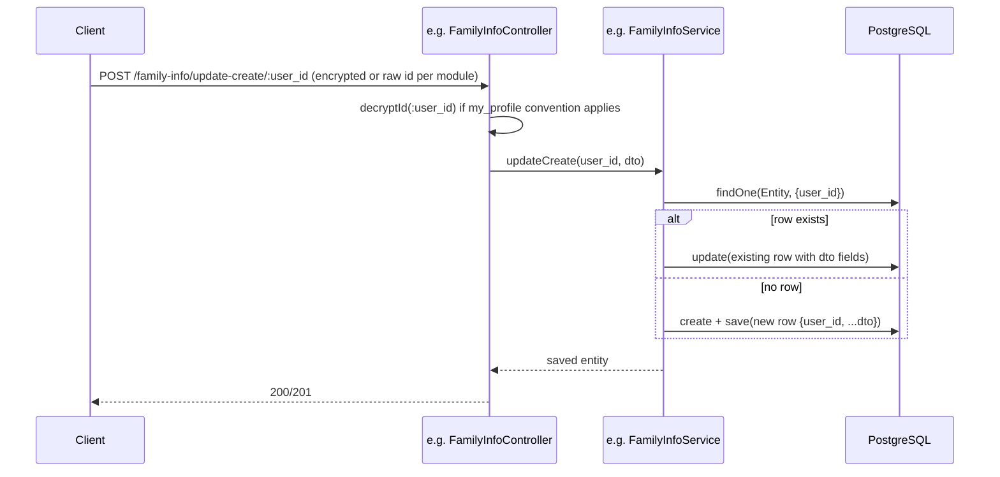
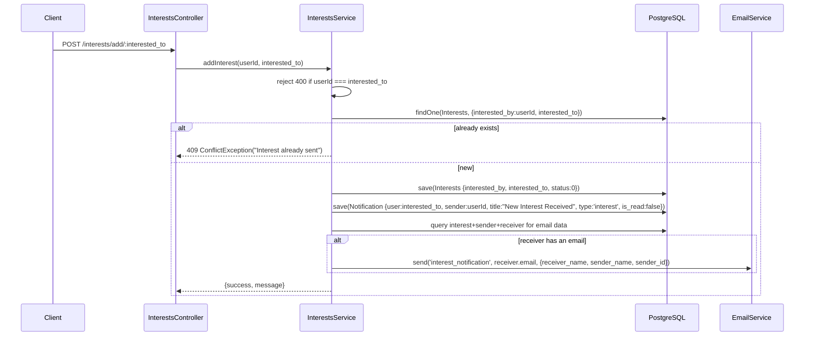
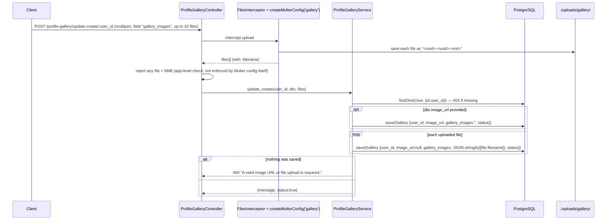
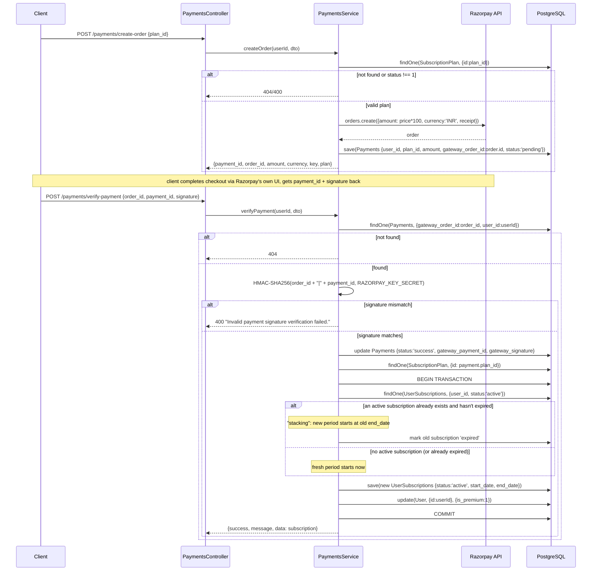
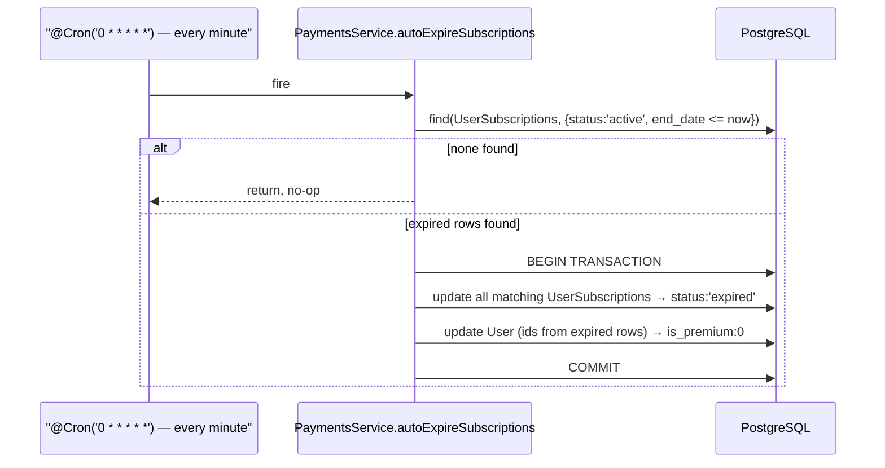

# Business Flows

Multi-step flows traced end-to-end through the actual source, not just single endpoints. Only flows that actually exist in the codebase are documented — see "Not applicable" at the bottom for flows that were checked for and are absent.

## User Registration

Note: `FRONTEND_URL` is not currently set in `.env` (see [SETUP.md](../SETUP.md)), so `login_url` resolves with `undefined` today. If the `registration_success` template row doesn't exist or is disabled, `EmailService.send` throws a plain `Error` (not an `HttpException`), which — since registration `await`s the email send — would currently surface as an unhandled 500 and roll back nothing already committed (the user/member/address rows are saved before the email step).

## Login (JWT issuance)

## JWT Authentication (per-request, every guarded route)

`req.user.is_premium`/`is_verified` are therefore fresh **as of the start of this request** — re-fetched by `JwtStrategy` on every call, not cached from token-issue time.

## Refresh Session

`AuthController.refreshSessio` has no `@UseGuards` of its own — it reads `req.user.id` assuming a prior guard elsewhere already populated it. There is no separate refresh-token (as distinct from access-token) issuance/rotation anywhere in the codebase — `JWT_REFRESH_SECERT_KEY`/`JWT_REFRESH_EXPIRES_IN` are defined in `.env` but unused.

## Upsert CRUD pattern (representative of all `my_profile/*` one-record-per-user sections)

Every `admin/*_management` mirror module repeats the same shape against the same entity, keyed by an explicit `:id`/`user_id` from the request rather than `req.user.id`.

## Interest / Notification / Email flow (send interest)

The same email-service-name has effectively two responsibilities: `EmailService.send` propagates any missing-template error as a plain JS `Error` (not an HTTP exception) — this happens *after* the interest and notification rows are already committed, so a missing/disabled `interest_notification` template row would surface as a 500 on an otherwise-successful interest send. The same pattern (create row → create notification → best-effort email) is used by `members/shortlist` and `admin/block_management`.

## Gallery File Upload

Public URLs for saved files are built on read via `appConfig.uploadsPath('gallery', filename)`, not stored pre-built in the database. Gallery rows start at whatever `status` the caller passed (or `0`); the admin `gallery_management` module's `PATCH /status/:user_id/:id` is the approval step that flips this.

## Payment / Subscription Flow

### Subscription expiry (scheduled)

The cron's own docstring says "at midnight" but the actual cron expression (`0 * * * * *`) fires every minute — confirm which cadence is intended before changing either. This job has no leader-election/locking, so running more than one app instance would let each instance independently (and redundantly, though not incorrectly — the `WHERE` clause is idempotent) run the same sweep.

## Not applicable / not found in this codebase

- **Password Reset** — Not Found. No forgot-password/reset-password controller, service method, route, or email template reference exists anywhere in `src/` (verified by search). Only `POST /auth/login` and `POST /auth/refresh-session` exist for credential-adjacent flows.
- **Refresh Token (as a distinct token type)** — Not Found as a real rotation flow. `JWT_REFRESH_SECERT_KEY`/`JWT_REFRESH_EXPIRES_IN` exist as env vars but are never read anywhere in `src/`; "refresh" in this codebase means re-signing a normal access token from live DB state (see "Refresh Session" above), not a separate refresh-token grant.
- **Queues/background workers** — Not Found. The only scheduled/background execution is the in-process `@Cron` subscription-expiry sweep above.
