# Database

## Overview

PostgreSQL, accessed via **TypeORM 0.3** (`@nestjs/typeorm`). Configured in `src/app.module.ts`: `autoLoadEntities: true`, **`synchronize: false`**, `ssl: { rejectUnauthorized: false }` only when `NODE_ENV === 'production'`. All 42 entity classes live under `src/entities/` (payment-related ones under `src/entities/payments/`). No custom TypeORM `Repository` subclass exists anywhere — every service injects the stock `Repository<Entity>` via `@InjectRepository(Entity)` and queries it directly.

## Migrations

**No migration tooling is configured** (no `typeorm migration:*` scripts, no `typeorm-extension`, no migrations folder). Combined with `synchronize: false`, this means **any `@Column`/entity change in this codebase does not take effect in the live database automatically** — the equivalent DDL must be applied by hand (or a migration workflow must be introduced) before the change is live anywhere. This is the single most likely source of "works locally, breaks in the shared database" drift in this project.

## Soft delete strategy

Soft delete is used inconsistently and is entity-specific, not a blanket convention:

- `users.deleted_at` — `@DeleteDateColumn`, TypeORM-managed soft delete. `JwtStrategy.validate()` and `UserService.validate_user()` both explicitly query `withDeleted: true` so a soft-deleted user can still be *looked up* (and even authenticate) — actual access is instead blocked by the `is_verified === 4` check layered on top (see [ARCHITECTURE.md](../ARCHITECTURE.md)).
- `members.deleted_at` — a plain nullable `timestamp` column (not a TypeORM `@DeleteDateColumn`), default `null`.
- No other entity in the schema has a `deleted_at`/soft-delete column — deletion elsewhere in the codebase (e.g. `education_info`, `siblings_info`, `report_management`) is a hard `DELETE`.

## Audit fields

Most entities carry `created_at` (`@CreateDateColumn`) and `updated_at` (`@UpdateDateColumn`), both `timestamp` type. There is no `created_by`/`updated_by` (actor-tracking) column on any entity — TypeORM's audit columns record *when*, not *who*.

## Status column conventions

Numeric "boolean-ish" status columns recur across nearly every entity: `status: number` (1 = active/enabled, 0 = inactive/disabled) is the master-data convention. Several member-authored entities layer a distinct **approval-style** status on top instead/additionally (e.g. `gallery.status` tracks an admin approve/reject workflow, `report_profiles.status` tracks a moderation lifecycle `pending → reviewed/rejected/action_taken`) — check the specific entity/service before assuming a status column's meaning.

## Constraints & indexes worth knowing about

- `users.email` — unique, indexed. `users.phone`, `users.is_online`, `users.is_verified` — indexed (not unique).
- `members.member_id` — unique (the public-facing member identifier, distinct from the numeric `id`).
- `genders.name`, `mother_tongue_master.name` — unique.
- `payments.gateway_order_id` — unique.
- `user_subscriptions` — `user_id`/`plan_id`/`payment_id` relations to `users`/`subscription_plans`/`payments` all declare `onDelete: 'CASCADE'`.
- `physical_attributes.id` is the **only UUID primary key** in the schema (`@PrimaryGeneratedColumn('uuid')`); every other entity uses an auto-increment integer id.
- No entity defines an explicit composite unique constraint beyond the single-column ones noted above (e.g. nothing prevents duplicate `interests`/`shortlists` rows for the same `(from, to)` pair at the database level — any such dedupe is application-layer, if present).

---

## Entities by domain

### Identity & core profile

**`users` — `User` (`src/entities/user.entity.ts`)**
Login/account entity — one row per credential set. Business purpose: the account of record for auth, status, and premium entitlement.

| Column | Type | Notes |
|---|---|---|
| id | PK, auto | |
| first_name, last_name | varchar(255) | |
| email | varchar(255), unique, indexed | |
| phone | varchar(255), indexed | |
| password | varchar | bcrypt-hashed (cost 10) via `@BeforeInsert hashPassword()` |
| is_online | int, default 1, indexed | |
| is_verified | int, default 0, indexed | 0=pending, 1=verified; also overloaded 2=suspended/3=deactivated/4=deleted by guards/strategy |
| is_premium | int, default 0 | read by `PremiumGuard` (`=== 1`), toggled by `PaymentsService` |
| role_id | smallint, default 0 | |
| account_status | varchar, nullable | free-text: `ACTIVE`/`BLOCKED`/`SUSPEND`/`DELETE` etc. |
| account_status_message | text, nullable | shown to the client on guard rejection |
| created_at / updated_at | timestamp | |
| deleted_at | timestamp, nullable | soft-delete (`@DeleteDateColumn`) |

Relations: one-to-many/one-to-one to nearly every profile-section and social-interaction entity — `members`, `education_info`, `professionInfos`, `familyInfo`, `siblings_info`, `lifestyleInfo`, `physical_attributes`, `hobbies_info`, `relative_info`, `present_address`, `permanent_address`, `astro`, `whilisted_by`/`whilisted_to`, `sent_bookmark`/`received_bookmarks`, `sent_interests`/`received_interests`, `shortlist_sent`/`shortlist_received`, `notifcations`, `blocked_profiles`/`blocked_by_profiles`, `payments`, `subscriptions`, `success_stories`.

**`members` — `MemberEntity` (`member.entity.ts`)**
The matchmaking-facing profile record — distinct from the login `User`. Business purpose: the public/discoverable identity a member presents to other members.

| Column | Type | Notes |
|---|---|---|
| id | PK, auto | |
| user_id → users | int, FK | |
| member_id | varchar(20), unique | public member identifier (`<year><4 random digits>`) |
| gender_id → genders | int, nullable, FK | |
| date_of_birth | date, nullable | |
| religion_id → religion_master | int, nullable, FK | |
| mother_tongue_id | int, nullable | see caveat below |
| about | text, nullable | |
| profile_image | text, nullable | |
| caste, sub_caste | varchar(100), nullable | |
| created_at / updated_at | timestamp | |
| deleted_at | timestamp, nullable | plain column, not a TypeORM `@DeleteDateColumn` |

**Caveat:** `motherTongue` is declared `@OneToOne(() => MotherTongueMasterEntity, (mt) => mt.id)` — mapped to the *id* property rather than a normal inverse relation property. Treat `mother_tongue_id` as the reliable FK; don't assume the `motherTongue` relation loads correctly without verifying.

### Member profile sections (each 1:1 or 1:N off `users`, under `my_profile/*`)

| Table | Entity file | Cardinality | Key columns / business purpose |
|---|---|---|---|
| `education_info` | education_info.entity.ts | 1:N | education_id→education_master, specialisation_id→specialisation_master, college_name, university_name, passing_year, country/state/city_id, is_highest_education, status — a member's education history |
| `profession_info` | profession_info.entity.ts | 1:N | profession_id→profession_master, designation_id→designation_master, company_name, experience, income, country/state/city_id, status — employment history |
| `family_info` | family_info.entity.ts | 1:1 | father/mother name/occupation/education/status, family_type, family_values, country/state/city_id, address, pincode, status — family background |
| `siblings_info` | siblings_info_entity.ts | 1:N | name, date_of_birth (string), relation, is_elder, marital_status, educational_qualification, profession, company_name, spouse_name/profession, children_count, country/state/city_id, status |
| `lifestyle_info` | lifestyle_info.entity.ts | 1:1 | diet, smoking, drinking, physical_status, fitness_level, sleep_habit, body_type, wake_up_time, living_style, family_type, social_habits, travel_habits, food_habits, fashion_style, pet_preference, driving_habit, work_life_balance, religious_life_style, status |
| `physical_attributes` | physical_attributes.entity.ts | 1:1 | **PK is a UUID**, height, weight, body_type, complexion, physical_status, blood_group, eye/hair color, hair_type/length, skin_tone, fitness_level, disability(+details), spectacles, lens_usage, beard_style, tattoo, physique, shoe_size, dress_size, health_condition, medical_conditions, genetic_disorders, appearance_notes, status |
| `hobbies_info` | hobbies_info.entity.ts | 1:N | hobbies, interests, favorite_music/movies/books, sports, activities, languages_known, entertainment_preferences, travel_interests, status |
| `relatives_info` | relatives_info.entity.ts | 1:N | relative_name, relation, occupation, location, contact_number, email, notes, status |
| `present_address` | present_address.entity.ts | 1:1 | address_line1/2, country/state/city_id, pincode, status |
| `permanent_address` | permanent_address_info.entity.ts | 1:1 | address_line1/2, country/state/city_id, pincode, status |
| `astronomic_info` | astronomic_info.entity.ts | 1:1 | zodiac_sign, moon_sign, padam, place_of_birth, time_of_birth, gothram, astro_notes, status |
| `gallery` | gallery.entity.ts | 1:N | gallery_images, image_url, status (admin approve/reject workflow — see `admin/gallery_management`) |
| `success_stories` | success_story.entity.ts | 1:N | groom_name, bride_name, image, description, marriage_date, location, status, decline_reason — admin-moderated (`admin/approve_success_story`) |

Country/State/City form a strict hierarchy referenced by id from `education_info`, `family_info`, `profession_info`, `siblings_info`, `present_address`, `permanent_address` — each of those entities duplicates its own `@ManyToOne` back to all three master tables rather than sharing a common address value-object.

### Master / reference data (admin-managed, under `admin/master/*`)

| Table | Entity | Business purpose / key columns |
|---|---|---|
| `countries` | country_master.entity.ts | name, phone_code, iso3, status; parent of `states` |
| `states` | state_master.entity.ts | name, country FK, status; parent of `cities` |
| `cities` | city_master.entity.ts | name, state FK, status |
| `genders` | gender.entity.ts | name (unique), status; referenced by `members` |
| `religion_master` | religion_master.entity.ts | name, status; referenced by `members` |
| `mother_tongue_master` | mother_tongue_master.entity.ts | name (unique), status |
| `education_master` | education_master.entity.ts | name, description, status; parent of `specialisation_master`, referenced by `education_info` |
| `specialisation_master` | specialisation_master.entity.ts (class `SpecialisationMaster`) | name, description, status, education_id FK (bigint) |
| `profession_master` | profession_master.entity.ts | profession_name, description, status; parent of `designation_master`, referenced by `profession_info` |
| `designation_master` | designation_master.entity.ts | designation_name, description, status, profession_id FK |
| `subscription_plans` | subscription_plan.entity.ts (`src/entities/payments/`) | name, description, price (decimal 10,2), duration_days, status, specifications (simple-json string[]); the catalogue behind the payments flow |
| `privacy_policies` | privacy_policy.entity.ts | name, icon, description, status |
| `terms_conditions` | terms_conditions.entity.ts | name, description, icon, status |
| `settings` | settings.entity.ts | single-row-style app config: app_name/logo/email/phone/address/website, **smtp_host/port/username/password/encryption/from_name/from_email** (drives outbound email — see [ARCHITECTURE.md](../ARCHITECTURE.md)), social links, primary/secondary_color, copyright_text, status |
| `email_templates` | email_template.entity.ts | template_key (unique), template_name, subject, html, status — `{{variable}}` placeholders substituted at send time by `EmailService` |

### Social interactions (member ↔ member, under `members/*`)

| Table | Entity | Direction columns | Business purpose |
|---|---|---|---|
| `interests` | interests.entity.ts | interested_by → interested_to (both to `users`) | Express serious interest; reason (text, required on reject), rejected_by, status |
| `shortlists` | shortlist.entity.ts | shortlisted_by → shortlisted_to | Save a profile for later consideration |
| `add_to_whilist` | add_to_whislist.entity.ts | whilisted_by → whilisted_to | "Wishlist" (entity/table/column spelling is `whilist`, not a typo to silently "fix") |
| `add_to_bookmarks` | add_to_bookmarks.entity.ts | sender_id → receiver (relation) | Bookmark a profile |
| `block_profiles` | block_profile.entity.ts | blocker_user_id → blocked_user_id | reason (text), is_active (bool) — safety feature |
| `report_profiles` | report_profile.entity.ts | reporter → reportedUser | reason, description, status (pending/reviewed/rejected/action_taken), admin_note, action_taken (banned/warned/no_action) — moderation lifecycle |
| `profile_visits` | profile_visttors.entity.ts (class `ProfileVisitEntity`) | viewer_id, profile_id (+ `viewer` relation) | Who viewed whom |
| `notifications` | notification.entity.ts | user (recipient) + sender relations | title, description, type (`interest`/`message`/`view`/`match`/`like`), is_read |
| `ratings` | ratings.entity.ts | user_id | rating (decimal 2,1), status — backs success-story ratings |

### Messaging

| Table | Entity | Business purpose |
|---|---|---|
| `chats` | chats.entity.ts | A conversation; has many `participants`, many `messages` |
| `chat_participants` | chat_participants.entity.ts | chat→chats, user→users — membership in a chat |
| `messages` | messages.entity.ts | chat→chats, sender→users, message (text), is_read |

### Payments & subscriptions (`src/entities/payments/`)

| Table | Entity | Business purpose |
|---|---|---|
| `payments` | payment.entity.ts | user_id, plan_id, amount (decimal 10,2), currency (default INR), payment_gateway (default `razorpay`), gateway_order_id (unique), gateway_payment_id, gateway_signature, status (default `pending`) — one row per Razorpay order attempt |
| `user_subscriptions` | user_subscription.entity.ts | user_id, plan_id, payment_id, start_date, end_date, status; relations to `users`/`subscription_plans`/`payments` all `onDelete: CASCADE` — the entitlement record read by `is_premium` logic |
| `subscription_plans` | subscription_plan.entity.ts | see master-data table above — the plan catalogue |

## Relationships summary

```mermaid
erDiagram
    users ||--o{ members : "owns"
    users ||--o{ education_info : ""
    users ||--o{ profession_info : ""
    users ||--o| family_info : ""
    users ||--o{ siblings_info : ""
    users ||--o| lifestyle_info : ""
    users ||--o| physical_attributes : ""
    users ||--o{ hobbies_info : ""
    users ||--o{ relatives_info : ""
    users ||--o| present_address : ""
    users ||--o| permanent_address : ""
    users ||--o| astronomic_info : ""
    users ||--o{ gallery : ""
    users ||--o{ success_stories : ""
    users ||--o{ interests : "sent/received"
    users ||--o{ shortlists : "sent/received"
    users ||--o{ add_to_whilist : "sent/received"
    users ||--o{ add_to_bookmarks : "sent/received"
    users ||--o{ block_profiles : "blocker/blocked"
    users ||--o{ report_profiles : "reporter/reported"
    users ||--o{ profile_visits : "viewer/viewed"
    users ||--o{ notifications : "recipient/sender"
    users ||--o{ payments : ""
    users ||--o{ user_subscriptions : ""
    users ||--o{ chat_participants : ""
    users ||--o{ messages : "sender"
    members }o--|| genders : "gender_id"
    members }o--|| religion_master : "religion_id"
    members }o--|| mother_tongue_master : "mother_tongue_id"
    countries ||--o{ states : ""
    states ||--o{ cities : ""
    education_master ||--o{ specialisation_master : ""
    profession_master ||--o{ designation_master : ""
    subscription_plans ||--o{ payments : ""
    subscription_plans ||--o{ user_subscriptions : ""
    payments ||--o| user_subscriptions : "funds"
    chats ||--o{ chat_participants : ""
    chats ||--o{ messages : ""
```

## Entity-relationship notes

- Nearly every "info" entity carries **both** a plain `user_id: number` column **and** a `@ManyToOne(() => User, ...) user` relation to it — code that only needs the id should query/select `user_id` directly rather than loading the relation.
- No entity in this codebase defines a custom TypeORM `Repository` class; all data access goes through the default `Repository<Entity>` returned by `@InjectRepository`.
- `payments.entity.ts`'s `payment_gateway` column defaults to `'razorpay'` and anticipates multi-gateway support, but nothing in the service layer branches on it today — Razorpay is the only integration.

See [docs/API.md](API.md) for which routes read/write each table and [docs/BUSINESS_FLOW.md](BUSINESS_FLOW.md) for how these tables are touched across a full user journey.
